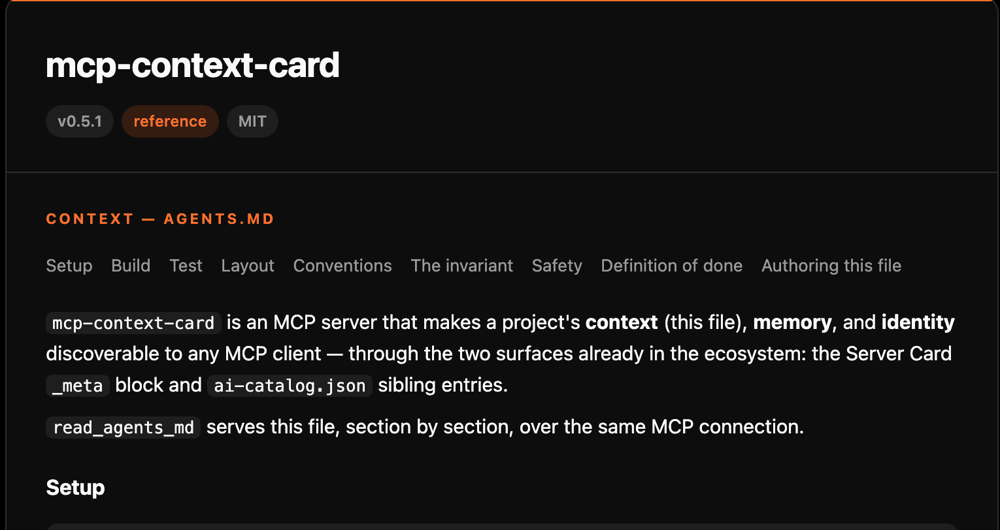

# mcp-context-card

[](https://github.com/Wolfe-Jam/mcp-context-card/actions/workflows/ci.yml)
[](./LICENSE)

An MCP server that makes a project's context, memory, and identity discoverable
to any MCP client — and renders them as one card you can read.

- **context** — the project's `AGENTS.md`, served whole or one section at a time
- **memory** — facts that persist across sessions, in a file
- **identity** — what this server is, from its own agent card

Discovery goes through two surfaces already in the ecosystem: the Server Card
`_meta` block and `ai-catalog.json` sibling entries.

## What it is / what it is not

**It is** — an MCP server for a project's `AGENTS.md`, memory, and identity: nine
tools, two discovery surfaces (Server Card `_meta`, `ai-catalog.json`), and a
rendered [card](#the-card). Small, MIT — read it, `npx` it, or fork it.

**It is not**

- a framework or a platform — three concerns, nothing more
- a file, shell, or search tool — it never touches your files or runs commands
- tied to FAF — context is plain Markdown (`AGENTS.md`); the memory and identity
  formats are swappable examples

It composes:

- **serve · discover · render** — this server
- **author · keep true** — [`agents-md-facts`](https://github.com/Wolfe-Jam/agents-md-facts) (the `author_agents_md` tool wraps it)
- **files · shell · git** — [`server-filesystem`](https://github.com/modelcontextprotocol/servers), [`server-git`](https://github.com/modelcontextprotocol/servers) / github‑mcp‑server, your test runner's MCP

A piece, not the toolbox.

## The card



The same three sources render as one self‑contained HTML page — identity,
`AGENTS.md`, memory, and how a machine fetches it. The view for people:
screenshot it, drop it in a PR, put it on a status page.

```
GET /card                      # live, on the HTTP transport
GET /card?theme=light&accent=%230066cc
npx mcp-context-card card       # or:  npm run card  →  docs/card.html
```

Light, dark, or auto; the accent defaults to the AAIF palette and takes any hex.
[docs/card.html](./docs/card.html) is this repo's, rendered.

## Who it's for

| You want… | Reach for |
|---|---|
| an `AGENTS.md` and you don't have one | `author_agents_md` — or [`npx agents-md-facts`](https://github.com/Wolfe-Jam/agents-md-facts) |
| your agent to pull *one* `AGENTS.md` section on demand, not the whole file | `read_agents_md` · `list_agents_md_sections` |
| a persistent notepad for your agent — survives restarts, no setup | `remember` · `recall` · `forget` |
| a shareable view of what your MCP server exposes to agents | `GET /card` · `npx mcp-context-card card` |
| the two‑surface discovery pattern to copy into your own server | read `src/` |

## Add it to your setup

### No `AGENTS.md` yet?

The `author_agents_md` tool authors one from your repo's facts — real
build/test commands, entry points, toolchain conventions — and hands the agent
the draft. It's a thin wrapper over
[`agents-md-facts`](https://github.com/Wolfe-Jam/agents-md-facts); to author or
keep one true outside a session:

```bash
npx agents-md-facts          # author / refresh AGENTS.md
npx agents-md-facts --check  # fail if missing or stale (CI, pre-commit)
```

A `project.faf` is the next rung — a structured source that refreshes the file.
Short model: [`agents-md-facts/docs/BETTER-BEST.md`](https://github.com/Wolfe-Jam/agents-md-facts/blob/main/docs/BETTER-BEST.md).

### See the card

One command, no host, no config:

```bash
npx mcp-context-card card > card.html
```

### Wire it into a host

Claude Desktop, Cursor, or any stdio host:

```jsonc
{
  "mcpServers": {
    "context-card": {
      "command": "npx",
      "args": ["-y", "mcp-context-card"],
      "env": { "MCP_CONTEXT_CARD_ROOT": "/abs/path/to/your/project" }
    }
  }
}
```

`MCP_CONTEXT_CARD_ROOT` points at the directory with your `AGENTS.md`. The
memory tools work with or without it; identity is optional. Over HTTP instead:
`PORT=8080 npx mcp-context-card`. Full wiring is in
[docs/WIRING.md](./docs/WIRING.md); transport choice in
[docs/TRANSPORT.md](./docs/TRANSPORT.md).

## Why

`AGENTS.md` is the de-facto standard for telling a coding agent how to work in a
repo. But a client has to *know the file exists* and read the whole thing into
context. There is no standard way for a server to say "here is my AGENTS.md,
here is what I remember, here is who I am" — so every server that wants this
grows its own shape.

`mcp-context-card` answers all three through mechanisms that already exist:

1. **Server Card `_meta`** ([SEP‑2127](https://github.com/modelcontextprotocol/modelcontextprotocol/pull/2127)) —
   one reverse‑DNS‑namespaced key per concern, readable in‑band as an MCP
   resource and at `GET /.well-known/mcp/server-card`.
2. **`ai-catalog.json`** — sibling entries keyed by media type, at
   `GET /.well-known/ai-catalog.json`.

The context concern points at `AGENTS.md` (`text/markdown`). Memory and identity
have no de‑facto standard yet, so the examples here use
[`.fafm`](https://doi.org/10.5281/zenodo.20348942) and
[`.fafa`](https://doi.org/10.5281/zenodo.21951641) — one instantiation each,
swap in your own.

The wire‑level detail is in [docs/MECHANISMS.md](./docs/MECHANISMS.md).

## Tools

| Tool | What it's for |
|---|---|
| `author_agents_md` | draft an `AGENTS.md` from the repo's facts (via `agents-md-facts`) — a managed block, ready to drop in |
| `read_agents_md` | return the project's `AGENTS.md` — whole, or one section by heading |
| `list_agents_md_sections` | the headings, so a client pulls one section instead of the whole file |
| `remember` | write a fact that will still be there next session |
| `recall` | read a fact stored in a previous session |
| `forget` | drop or correct a stale fact |
| `whoami` | this server's name, vendor, version, status, license |
| `list_context_sources` | what this project publishes, in what media types, via which surface |
| `render_context_card` | the whole card as one self‑contained HTML page (also `GET /card`) |

## The demo

`npm run demo` runs every tool over both transports:

1. **Context** — list the `AGENTS.md` sections, then pull just `## Test`.
2. **Memory** — `remember()` a fact, stop the server process, start a new one,
   `recall()` the same fact. Only the file carries it across.
3. **Identity** — `whoami()`, and the Server Card `_meta` block read back from a
   live client.
4. **Discovery** — `list_context_sources()`, then the same server over stateless
   HTTP with its `.well-known` routes and `GET /card`.

99 tests on Linux, macOS, and Windows, coverage‑gated in CI. Two spawn a real
child process and check a remembered fact survives the restart — one against
an existing `project.fafm`, one starting from a project that has never had
one; another checks the stdio and HTTP tool surfaces match.

## Layout

| Path | What |
|---|---|
| `src/server.ts` | the nine tools + the Server Card resource |
| `src/agents-md.ts` | reads and section‑splits `AGENTS.md` |
| `src/author.ts` | `author_agents_md` — wraps [`agents-md-facts`](https://github.com/Wolfe-Jam/agents-md-facts) |
| `src/md.ts` | a minimal dependency‑free Markdown → HTML renderer |
| `src/render-card.ts` | the card — identity + `AGENTS.md` + memory + discovery, as one HTML page |
| `src/memory.ts` | file‑backed `remember` / `recall` / `forget` |
| `src/identity.ts` | `whoami` (`.fafa` → `package.json` fallback) + the `_meta` block |
| `src/catalog-gen.ts` | writes `ai-catalog.json` from the same three sources |
| `src/transport/http.ts` | the stateless Streamable HTTP app (Hono) |
| `src/bin.ts` | the entry point — `stdio` · `--http` · `card` |

## Related

- [Server Card SEP‑2127](https://github.com/modelcontextprotocol/modelcontextprotocol/pull/2127) · [ai-catalog](https://github.com/Agent-Card/ai-catalog) · [AGENTS.md](https://agents.md)
- [`mcp-project-context`](https://github.com/Wolfe-Jam/mcp-project-context) — an earlier take on the context concern alone
- `text/markdown` (AGENTS.md) · `application/vnd.fafm+yaml` · `application/vnd.fafa+yaml`

## License

MIT.

This repo dogfoods what it serves — its `AGENTS.md` is a real, current file, and
it ships a `project.faf` as the structured source behind it.
